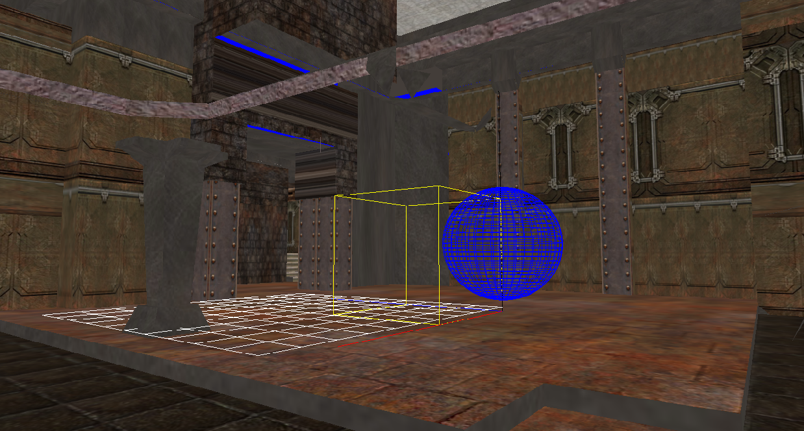
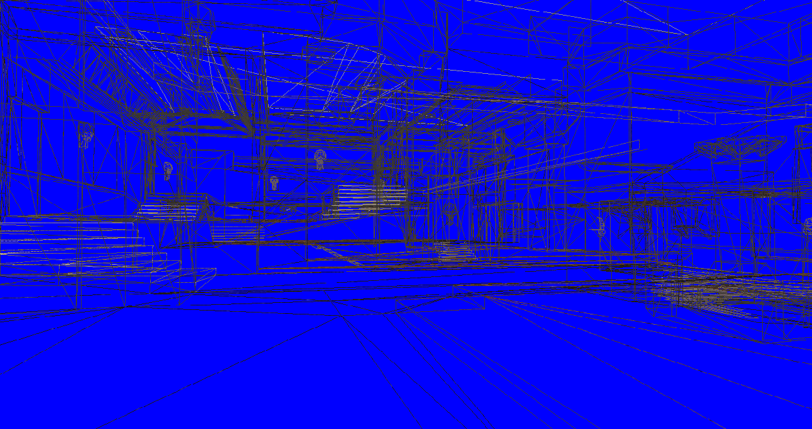

# UOC Motors Gràfics Pac1





## Com Executar

Dins de `Executable` es troben els executables compilats llestos per executar directament.  Hi ha la versió de **Debug** i **Release**.

## Com  compilar

El repositori es pot configurar utiltizant premake5 i llençant la comanda `premake5 generator` . Per exemple per una solució de vs20:

```
premake5 vs2022
```

El projecte s'ha dissenyat sota MCVS 2022 i C++20. Segurament és retrocompatible amb versions més antigues encara que no s'ha provat.

Un cop executat genera la solució `.sln` que es pot obrir i executar.

## Com jugar

**WASD** pel moviment del personatge.

**Space** per saltar

**Ratolí** per rotar la càmera.

**C i tab** per canviar càmera i controlador.

**Q** per activar i desactivar el debug renderer.

**E** per activar i desactivar el wireframe renderer.

## Implementació:

Com a norma general durant la implementació s'ha actualitzat diferents parts del codi per seguir els regles del RAII. El canvi principal és canviar una gran part de raw pointers a `std::unique_ptr`. 

A més a més s'han eliminat aquelles funcions `init` i/o `Destroy`  i moure la lògica als constructors i destructors.

Altres canvis menors és l'ús de `string_views` per tenir una millor empremta de memòria.

**Tots els canvis dels TODO a implementar es poden veure a la PR** (En aquest informa només hi ha els canvis més significatius).

https://github.com/Onnion19/UOC_GE/pull/1/files

### 1. Implementació de les càmeres: 

- Càmera Mànager: https://github.com/Onnion19/UOC_GE/pull/1/files#diff-a9bca573b37a851c52875172f29325285cc5886b739fe186bed1adb7be6d97ce

- Càmera Controller: https://github.com/Onnion19/UOC_GE/pull/1/files#diff-d9ff4727716756ac51aaed5c0465f2dc6225f4525a133b7827a147c48c3931f9

​	Càlcul dels vectors Up i Right: 

```c++
XMFLOAT3 CCameraController::GetUp() const
{
	// En aquest cas de moment he decidit només tenir el UP perpendicular al plaXZ .
	// Quan la càmera hagi de rotar en 3 eixos, aleshores es re-implementarà per tenir en compte el yaw, pitch, roll
	return { 0, cos(m_Pitch),0};
}


XMFLOAT3 CCameraController::GetRight() const
{
    // Utilitzo el cross product per trobar el vector perpendicular al forward i up.
	auto forward = GetDirection();
	auto up = GetUp();

	auto forwardvec = XMLoadFloat3(&forward);
	auto upvec = XMLoadFloat3(&up);

	auto rightvec = DirectX::XMVector3Cross(forwardvec, upvec);
	XMFLOAT3 right;
	XMStoreFloat3(&right, rightvec);
	return right;
}
```


- Càmera:https://github.com/Onnion19/UOC_GE/pull/1/files#diff-1bac867d857912711b15db511f561ba46522bf71668579bcf60258a304bf83ec

- FPS Camera Controller: https://github.com/Onnion19/UOC_GE/pull/1/files#diff-9120cfa7c65ce0fc0e4a3149d076b63da910b8fdbd72b6ae406934cf88793655

Set Càmera: 
```c++
void CFPSCameraController::SetCamera(CCamera* Camera) const
{
	Camera->SetFOV(DEG2RAD(50.f));
	Camera->SetAspectRatio(16.f / 9.f);

	auto direction = GetDirection();
	XMVECTOR directionVec = XMLoadFloat3(&direction);
	XMVECTOR positionVec = XMLoadFloat3(&m_Position);
	XMFLOAT3 lookAt{};
    // Volem mirar endavant, així que mirarem des del jugador cap endavant.
	auto lookAtVec = DirectX::XMVectorAdd(positionVec, directionVec);
	XMStoreFloat3(&lookAt, lookAtVec);
	Camera->SetLookAt(lookAt);
	Camera->SetPosition(m_Position);
	Camera->SetUp(GetUp());
	Camera->SetMatrixs();
}
```


Càlcul dels vector de direcció: 
``` c++
XMFLOAT3 CFPSCameraController::GetDirection() const
{
	XMFLOAT3 direction = 	 {
		cos(m_Yaw), sin(m_Pitch),sin(m_Yaw)
	};
	return direction;
}
```

Moviment: 
```c++
void CFPSCameraController::Move(float Strafe, float Forward, bool Speed, float ElapsedTime)
{

	XMFLOAT3 forwardVec = GetDirection();
	XMVECTOR forward = XMLoadFloat3(&forwardVec);

	XMFLOAT3 rightVec = GetRight();
	XMVECTOR right = XMLoadFloat3(&rightVec);

	XMVECTOR movement = DirectX::XMVectorAdd(
		DirectX::XMVectorScale(forward, Forward),
		DirectX::XMVectorScale(right, Strafe)
	);

	movement = DirectX::XMVector3Normalize(movement);

	float speedMultiplier = Speed ? m_FastSpeed : m_Speed;
	movement = DirectX::XMVectorScale(movement, speedMultiplier * ElapsedTime);

	XMVECTOR currentPosition = XMLoadFloat3(&m_Position);
	XMVECTOR newPosition = DirectX::XMVectorAdd(currentPosition, movement);
	XMStoreFloat3(&m_Position, newPosition);
}
```


Spherical Camera Controller:https://github.com/Onnion19/UOC_GE/pull/1/files#diff-fce7ae56ceb952bcaef1e365ddad65dc1472664a36153ac2e18222cf0ef0fbee

Moviment: 

```c++

void CSphericalCameraController::Update(float ElapsedTime)
{
	auto mouseInput = CUOCEngine::GetEngine()->GetInputManager()->GetMouse();
	AddYaw(mouseInput->GetMovementX() * ElapsedTime * m_RotationSpeed);
	AddPitch(mouseInput->GetMovementY() * ElapsedTime * m_RotationSpeed);
	AddZoom(mouseInput->GetMovementZ() * ElapsedTime * m_ZoomSpeed);
}
```

Set Càmera: 
```c++
void CSphericalCameraController::SetCamera(CCamera* Camera) const
{
	Camera->SetFOV(DEG2RAD(50));
	Camera->SetAspectRatio(16.f / 9.f);
	Camera->SetLookAt(m_Position);
    // Volem girar al volant del jugador, així que apuntem cap al centre.
	{
		const auto x = Camera->GetPosition().x - m_Position.x;
		const auto y = Camera->GetPosition().y - m_Position.y;
		const auto z = Camera->GetPosition().z - m_Position.z;
		Camera->SetPosition({ x,y,z });
	}
	Camera->SetUp(GetUp());
	Camera->SetMatrixs();
}
```


---

### 2. Debug Renderer : 

https://github.com/Onnion19/UOC_GE/pull/1/files#diff-dc2b60de66d9fe68e81166ab2f71f3a147bf536ab00529831947865643f43d4c

Dins d'aquesta classe el més destacable és el càlcul del grid i de l'esfera. En els dos casos es calculen les arestes en els diferents (eixos o plans) al mateix temps, reduïnt així les iteracions.

En el cas de la graella: 
```c++
	constexpr float l_Size = 10.0f;
	constexpr int l_Grid = 10; // subdivision de la graella
	constexpr float deltaGrid = l_Size / l_Grid; // Delta entre subdivisions
	constexpr auto gridVert = (l_Grid + 1) * 2 * 2; // Nombre de vertex
	constexpr float height = 0.15f; // Una mica alçat per veure's millor.
	UOC_POSITION_COLOR_VERTEX l_GridVtxs[gridVert];

	for (int i = 0; i <= l_Grid; i++)
	{
		const int positionX = i * 2;
		const int positionZ = gridVert / 2 + positionY;
        // Càlcul en l'eix X
		l_GridVtxs[positionX] = { XMFLOAT3(deltaGrid * i, height, 0.0f), WHITE };
		l_GridVtxs[positionX + 1] = { XMFLOAT3(deltaGrid * i, height, l_Size), WHITE };
		// Càlcul en l'eix Z
		l_GridVtxs[positionZ] = { XMFLOAT3(0.f, height, deltaGrid * i), WHITE };
		l_GridVtxs[positionZ + 1] = { XMFLOAT3(l_Size, height, deltaGrid * i), WHITE };
	}	
```


En el cas de l'esfera, s'ha optat per utilitzar coordenades esfèriques per calcular els vèrtex i després convertir-los a coordenades cartesianes.

```c++
// Theta = angle en l'eix Y [0 - 180]
// Sigma = angle al pla XZ. [0 - 360]
constexpr auto SphericaltoCartesian = [](float thetaRadians, float sigmaRadians, float radius) ->XMFLOAT3 {
		return {
			radius * sin(thetaRadians) * cos(sigmaRadians),
			radius * cos(thetaRadians) + radius*1.2f, //add radius to offset the sphere to be fully visible.
			radius * sin(thetaRadians) * sin(sigmaRadians)
		};
	};
```

Tenint aquesta informació, la generació dels vèrtex és: 
```c++
// Cercle amb alta definició (80 cercles (40 per cada pla), cada un amb 40 vèrtex).
constexpr int l_VertexCircle = 40;
constexpr int l_circles = 40;
constexpr int verticesCount = l_VertexCircle * (l_circles) * 4;
constexpr float thetaDelta = DEG2RAD(180) / l_circles;
constexpr float sigmaDelta = DEG2RAD(360) / l_VertexCircle;
constexpr float radius = 1.f;
UOC_POSITION_COLOR_VERTEX l_SphereVtxs[verticesCount];

for (int circle = 0; circle < l_circles; circle++) //Per cada cercle que volem dibuixar
	{
		auto theta = thetaDelta * (circle);
		for(int vertice = 0; vertice < l_VertexCircle; vertice++) // Per cada vèrtex dins el cercle
		{
			auto sigma = sigmaDelta * vertice;
			
            // Càlcul del vertex actual i els seus adjacents,
			auto originalPos = SphericaltoCartesian(theta, sigma, radius);
			auto nextXZpos = SphericaltoCartesian(theta, sigma + sigmaDelta, radius);
			auto nextXYpos = SphericaltoCartesian(theta + thetaDelta, sigma, radius);

			// Càlcul de l'index del vector de vèrtexs.
			auto arrayIndex = circle * l_VertexCircle * 4 + vertice *4;
			assert(arrayIndex + 3 < verticesCount);
			
            // Creació de les "arestes".
			l_SphereVtxs[arrayIndex] = { originalPos, WHITE };
			l_SphereVtxs[arrayIndex+1] = { nextXZpos, WHITE };

			l_SphereVtxs[arrayIndex +2] = { originalPos, WHITE };
			l_SphereVtxs[arrayIndex +3] = { nextXYpos, WHITE };

		}
	}
```

---

### 3. Implementació dels mànagers i aplicació

- **Effect Manager:** https://github.com/Onnion19/UOC_GE/pull/1/files#diff-764ddb9a51829f1f6bdca6758f57bc7666ef5919afbaebbb384a1156343bd600

  Apart d'aplicar els `To Do` que hi havia, l'únic cànvi a tenir en compte és la utilització de `unique_ptr`

  ```c++
  std::map<unsigned int, std::unique_ptr<CEffect>> m_EffectsByVertexType;
  std::map<std::string, std::unique_ptr<CEffect>>	m_Effects;
  ```

  La resta de punters segueixen sent raw, ja que els inicialitza el Device Context i per tant, no tinc ownership.

- **CTextureManager**: https://github.com/Onnion19/UOC_GE/pull/1/files#diff-1ef961de9b081fd7806d7602992c9656a44fd710e723f37e6ad3b55b769e406e

  La funció més important és segurament el Load Texture.

  ```c++
  CTexture* CTextureManager::LoadTexture(ID3D11Device* Device, const std::string& Filename)
  {
  	auto iter = m_TextureMap.find(Filename);
  	if (iter != m_TextureMap.end()) return iter->second.get(); // Agafant les dades del unique_ptr
  
  
  	std::string name;
  	GetFilename(Filename.c_str(), name);
  	std::string texturePath{ PATH_TEXTURES };
  	texturePath.append(name);
  
  
  	auto tuple = m_TextureMap.emplace(texturePath, new CTexture()); //Creat un unique_ptr insitu.
  
  	if (!tuple.second) return nullptr; // verificar que l'emplace ha set correcte.
  
  	CTexture* texture = tuple.first->second.get();
  	texture->Load(Device, texturePath);
  	return texture;
  }
  ```

- **CUOCEngine**: https://github.com/Onnion19/UOC_GE/pull/1/files#diff-74d8ae713d29e4de80754db0059d0f27e5e241d563ccae8df23c90a9179335ca

  Aquesta classe és la que gestiona els events per la resta de mànagers, el més destacable:

  **Inicialització:**

   ```c++
   CUOCEngine* CUOCEngine::GetEngine()
   {
   	if (!m_UOCEngine) m_UOCEngine = new CUOCEngine();
   	return m_UOCEngine;
   }
   
   void CUOCEngine::Init(HWND hWnd, int Width, int Height)
   {
       // Tots els managers són unique ptr, així que no cal destruir-los explicitament.
   	m_RenderManager = std::make_unique<CRenderManager>(hWnd, Width, Height);
   	m_InputManager = std::make_unique<CInputManager>(hWnd);
   	m_EffectManager = std::make_unique<CEffectManager>();
   	m_DebugRender = std::make_unique<CDebugRender>(m_RenderManager->GetDevice());
   	m_CameraManager = std::make_unique<CCameraManager>();
   	m_CameraManager->Load("DATA/XML/cameras.xml");
   	m_FBXManager = std::make_unique<CFBXManager>();
   	m_RenderableObjectManager = std::make_unique<CRenderableObjectManager>();
   	m_TextureManager = std::make_unique<CTextureManager>();
   	m_PreviousTimeStamp = std::chrono::steady_clock::now();
   }
   
   ```

  **Update** 

  El canvi més gran és en l'obtenció del temps passat, he decidit utilitzar la llibreria `chrono` ja està definida segons la arquitectura de cada ordinador, i al mateix temps permet més flexibilitat en com interpretar les dades.

  Pel que fa la qualitat i precisió de la mesura, ambdós casos utilitzen el hardware (CPU) per aconseguir una mesura de l'ordre de `nano`.

  ```c++
  // Definició dels rellotges
  using clock = std::chrono::steady_clock;
  clock::time_point m_PreviousTimeStamp;
  std::chrono::duration<float, std::ratio<1, 1>>	m_ElapsedTime; // Elapsed time en segons.
  ```

  

  Així el update queda de la següent forma:

  ```c++
  void CUOCEngine::Update()
  {
  	const auto currentTime = clock::now();
  	m_ElapsedTime = currentTime - m_PreviousTimeStamp; // En segons (sense perdre precisió)
  	m_PreviousTimeStamp = currentTime;
  
  	m_InputManager->Update();
  
  	CKeyboardInput* l_KeyboardInput = m_InputManager->GetKeyboard();
  
  	CCameraController *l_CameraController=m_CameraManager->GetCameraController("player");
  
  	CKeyboardInput *l_KeyboardInput=m_InputManager->GetKeyboard();
  	if (l_KeyboardInput->KeyBecomesPressed(DIK_TAB))
  	{
  		m_CameraManager->ChangeVision();
  	}
  
  	if (l_KeyboardInput->KeyBecomesPressed(DIK_C))
  	{
  		m_CameraManager->ChangeControl();
  	}
      
      // Toggle del debug render
      if (l_KeyboardInput->KeyBecomesPressed(DIK_Q))
  	{
  		auto renderDebug = m_RenderManager->GetDrawAxisGridAddress();
  		*renderDebug = !*renderDebug;
  	}
  
      // Toggle del wireframe
  	if (l_KeyboardInput->KeyBecomesPressed(DIK_E))
  	{
  		auto paintSolid = m_RenderManager->GetPaintSolidAddress();
  		*paintSolid = !*paintSolid;
  	}
  
  	m_CameraManager->Update(m_ElapsedTime.count());
  	m_RenderableObjectManager->Update(m_ElapsedTime.count());
  }
  ```

  **Render**

  Finalment la gestió del render: 

  ```c++
  void CUOCEngine::Render()
  {
  	m_RenderManager->BeginRenderDX();
  	ID3D11DeviceContext* l_DeviceContext = m_RenderManager->GetDeviceContext();
  
  	if (m_RenderManager->GetPaintSolid())
  		m_RenderManager->SetSolidRenderState(l_DeviceContext);
  	else
          m_RenderManager->SetWireframeRenderState(l_DeviceContext);
  	
    // Agafar les diferents views per fer la matrou VP
  	const auto& view = m_CameraManager->GetCamera().GetView();
  	const auto& proj = m_CameraManager->GetCamera().GetProjection();
    
  	CEffectManager::m_SceneConstantBufferParameters.m_View = DirectX::XMMatrixTranspose(view);
  	CEffectManager::m_SceneConstantBufferParameters.m_Projection = DirectX::XMMatrixTranspose(proj);
  
   // Actualitzar la matriu VP als uniforms
  	m_EffectManager->SetSceneConstantBuffer(l_DeviceContext);
  	m_RenderableObjectManager->Render(l_DeviceContext);
  
   // Render debug
  	if (m_RenderManager->DrawAxisGrid())
  	{
  		XMMATRIX world = DirectX::XMMatrixIdentity();
  		CEffectManager::m_ObjectConstantBufferParameters.m_World = DirectX::XMMatrixTranspose(world);
  		m_EffectManager->SetObjectConstantBuffer(l_DeviceContext);
  		m_DebugRender->DrawAxis(l_DeviceContext, 8.f);
  		m_DebugRender->DrawGrid(l_DeviceContext, 1.f, { 1.f, 1.f, 1.f, 1.f });
  		m_DebugRender->DrawCube(l_DeviceContext, 4.f, { 1.f, 1.f, 0.f, 1.f });
  		m_DebugRender->DrawSphere(l_DeviceContext, 2.f, { 0.f, 0.f, 1.f, 1.f });
  	}
  	m_RenderManager->EndRenderDX();
  }
  ```

  

- **CRenderManager**: https://github.com/Onnion19/UOC_GE/pull/1/files#diff-ce715b6691cdc3b364d2065cb050d5116dbc8af2ea6b84d399d5ed23368b0ff2

  Encarregat de gestionar el Device i Device context que contra qui s'intenta renderitzar. També gestiona altres aspectes més generals del rendering, com el RenderTarget, stencil buffers  o el color de fons.

- **CApplicationDX**:https://github.com/Onnion19/UOC_GE/pull/1/files#diff-98d7e42fadb2b37bc5831f42d8a65711d8295f9ef880d8372a7e59f8eface536

  L'aplicació vindria a ser el `game code` on es programa el joc a sobre. Per aquest motiu és qui gestiona el jugador i s'encarrega de la inicialització del motor

  ---

  

### 4. FBX

- **FBX Mànager**: https://github.com/Onnion19/UOC_GE/pull/1/files#diff-001df1ded878c1e50b7dca44b62e68e843c079a6c850dee50d26d7718010cc00

  Encarregat de carregar els fitxers fbx a disc i parsejar la informació. La majoria de canvis en aquesta classe és passar punters a `unique_ptr` per promoure el RAII.

  ```c++
  class CFBXManager final
  {
  private:
  	std::vector<CFBXStaticMesh *>m_StaticMeshes;
  	FbxManager	*m_Manager;
  	void ImportNode(FbxNode *Node);
      // RAII
  	std::vector<std::unique_ptr<CFBXStaticMesh>> m_StaticMeshes;
      static constexpr auto fbxManagerDtor = [](FbxManager* manager) {manager->Destroy(); };
  	std::unique_ptr<FbxManager, decltype(fbxManagerDtor)>	m_Manager;
      
  	void ImportNode(FbxNode* Node);
  public:
  	CFBXManager();
  	void Load(std::string_view Filename);
  };
  
  CFBXManager::CFBXManager()
  	: m_Manager(FbxManager::Create(), fbxManagerDtor)
  {
  	FbxIOSettings *l_IOSettings=FbxIOSettings::Create(m_Manager.get(), IOSROOT);
  	m_Manager->SetIOSettings(l_IOSettings);
  }
  ```
  
- **FBX Static Mesh**: https://github.com/Onnion19/UOC_GE/pull/1/files#diff-e4b96b7c222e1489ea1a1bc0217ac964b87be7f41b86cf3c9b817d2b02c7cbc5

  El canvi més important és la càrrega dels vèrtex del model als buffers, el qual evita duplicats. A més a més s'ha eliminat codi duplicat que es podia replicar de forma iterativa.

  El codi mostrat a continuació és només un abstracte petit per mostrar els canvis més significatius. Els canvis complerts es poden veure al link anterior a la pull request.

  ```c++
  // codi tallat //
  
  	std::vector<std::vector<UOC_POSITION_NORMAL_TEXTURE_VERTEX>> l_FullVertexs;
  	std::vector<std::vector<unsigned short>> l_Indices;
  
  	// Mapa que controla els vèrtex existens.
  	// Utilitza l'index (GetPolygonVertex) com a clau, i l'index del vector l_FullVertexs on es troba com a valor.
  	std::vector < std::unordered_map <int, unsigned short>> l_verticesMap;
  
  	InicialitzarElsBuffers();// Funció no real, per escurçar el codi
  
  	for (int i = 0; i < Mesh->GetPolygonCount(); ++i)
  	{
  		int l_MaterialId = l_MaterialIndices->GetAt(i);
  		int l_PolygonVertexsCount = Mesh->GetPolygonSize(i);
          
          // Per cada vèrtex del polígon
  		for (int vertice = 0; vertice < l_PolygonVertexsCount; vertice++)
  		{
              // Agafar l'index (identificador) del vèrtex.
              int l_Index = Mesh->GetPolygonVertex(i, vertice);
  
              // Comprovar si el vèrtex ja existeix
              auto vertice_iter = l_verticesMap[l_MaterialId].find(l_Index);
  			if (vertice_iter != l_verticesMap[l_MaterialId].end())
  			{
                  // Si existeix, afegir als index la posició del vèrtex dins del vector l_FullVertexs.
  				l_Indices[l_MaterialId].push_back(vertice_iter->second);
  				continue;
  			}
  
              // Si no existeix agafar les dades del vèrtex (Normal, UV, posició...)            
             	UOC_POSITION_NORMAL_TEXTURE_VERTEX l_FullVertex  GetVertexInformation(); // Funció no real, per escurçar el codi.
              
              // Afegir al nou vèrtex als VBO IBO, i al mapa de vèrtex.
  			l_FullVertexs[l_MaterialId].emplace_back(l_FullVertex);
  			l_verticesMap[l_MaterialId][l_Index] = static_cast<unsigned short>(l_FullVertexs[l_MaterialId].size()-1);
  			l_Indices[l_MaterialId].emplace_back((unsigned short)l_FullVertexs[l_MaterialId].size()-1);
  			
              
              UpdateBoundingBox(m_BBMax, m_BBMin, l_FullVertex); // Funció no real, per escurçar el codi.
  		}
  	}
  ```

  *Nota:* S'ha utilitzat un `unordered_map`  ja que és més òptim en situacions on hi ha moltes insercions i l'ordre dels elements no ens importa.

---

### 5. Input i jugador

- **Keyboard Input**:https://github.com/Onnion19/UOC_GE/pull/1/files#diff-300c301e130dc8b1d11058cb4d0f77df5e2705adec29f861706103f864b0a813

  Encarregat de gestionar l'entrada del teclat i permet fer pooling de l'estat de les tecles: 

  ```c++
  bool CKeyboardInput::IsKeyPressed(int KeyCode) { return (m_Diks[KeyCode] & 0x80) != 0; }
  bool CKeyboardInput::WasKeyPressed(int KeyCode) { return (m_PreviousDiks[KeyCode] & 0x80) != 0; }
  bool CKeyboardInput::KeyBecomesPressed(int KeyCode) { return IsKeyPressed(KeyCode) && !WasKeyPressed(KeyCode); }
  bool CKeyboardInput::KeyBecomesReleased(int KeyCode) { return !IsKeyPressed(KeyCode) && WasKeyPressed(KeyCode); }
  ```

- **Mouse Input** https://github.com/Onnion19/UOC_GE/pull/1/files#diff-faf6a6b4da377d37dce1546fb6ecff37270623ea157e9280cb0833d237f50cc4

  Encarregat de gestionar l'entrada del ratolí i permet fer pooling dels botons premuts:

  ```c++
  bool CMouseInput::Update()
  {
  	DIMOUSESTATE2 l_DIMouseState;
      if(m_Mouse==NULL)
          return false;
  
      // Agafar l'estat del ratolí
  	ZeroMemory(&l_DIMouseState, sizeof(l_DIMouseState));
      HRESULT l_HR=m_Mouse->GetDeviceState( sizeof(DIMOUSESTATE2), &l_DIMouseState);
      if(FAILED(l_HR))
      {
          l_HR=m_Mouse->Acquire();
          while(l_HR==DIERR_INPUTLOST)
              l_HR=m_Mouse->Acquire();
          return true;
      }
      // Guardar l'estat del ratolí al frame actual i prèvi
  	m_MovementX = l_DIMouseState.lX;
  	m_MovementY = l_DIMouseState.lY;
  	m_MovementZ = l_DIMouseState.lZ;
  
  	m_PreviousButtonLeft = m_ButtonLeft;
  	m_PreviousButtonMiddle = m_ButtonMiddle;
  	m_PreviousButtonRight = m_ButtonRight;
  
  	m_ButtonRight = (l_DIMouseState.rgbButtons[1] & 0x80) != 0;
  	m_ButtonLeft = (l_DIMouseState.rgbButtons[0] & 0x80) != 0;
  	m_ButtonMiddle = (l_DIMouseState.rgbButtons[2] & 0x80) != 0;
  	return true;
  }
  
  int CMouseInput::GetMovementX() const { return m_MovementX; }
  int CMouseInput::GetMovementY() const {	return m_MovementY; }
  int CMouseInput::GetMovementZ() const { return m_MovementZ; }
  bool CMouseInput::IsRightButtonPressed() const { return m_ButtonRight; }
  bool CMouseInput::IsLeftButtonPressed() const {	return m_ButtonLeft; }
  bool CMouseInput::IsMiddleButtonPressed() const { return m_ButtonMiddle; }
  bool CMouseInput::LeftButtonBecomesPressed() const { return m_ButtonLeft && !m_PreviousButtonLeft; }
  bool CMouseInput::MiddleButtonBecomesPressed() const { return m_ButtonMiddle && !m_PreviousButtonMiddle;}
  bool CMouseInput::RightButtonBecomesPressed() const { return m_ButtonRight && !m_PreviousButtonRight; }
  bool CMouseInput::LeftButtonBecomesReleased() const { return !m_ButtonLeft && m_PreviousButtonLeft; }
  bool CMouseInput::MiddleButtonBecomesReleased() const { return !m_ButtonMiddle && m_PreviousButtonMiddle; }
  bool CMouseInput::RightButtonBecomesReleased() const { return !m_ButtonRight && m_PreviousButtonRight; }
  ```

  - **Player**: https://github.com/Onnion19/UOC_GE/pull/1/files#diff-5ccec7ab05637b993150dba2c500da814b0653177baaa819e0efe4b195d7d235

    El jugador és l'element interactiu i per això és l'encarregat de processar l'input a cada frame: 

    ```c++
    void CPlayer::Update(float ElapsedTime)
    {
    	auto inputManager = CUOCEngine::GetEngine()->GetInputManager();
    	assert(inputManager);
    	CKeyboardInput* l_KeyboardInput = inputManager->GetKeyboard();
    	CMouseInput* l_MouseInput = inputManager->GetMouse();
    
        // Actualitzar la rotació de la càmera
    	m_FPSCameraController->AddYaw(l_MouseInput->GetMovementX() * ElapsedTime);
    	m_FPSCameraController->AddPitch(l_MouseInput->GetMovementY() * ElapsedTime);
    
    	float l_Forward = 0.0f;
    	float l_Strafe = 0.0f;
    	bool l_MoveFast = l_KeyboardInput->IsKeyPressed(DIK_LSHIFT);
    
        // Comprovar si hi ha alguna tecla de moviment premuda
    	if (l_KeyboardInput->IsKeyPressed(DIK_W))
    	{
    		l_Forward = 1.f;
    	}
    	else if (l_KeyboardInput->IsKeyPressed(DIK_S))
    	{
    		l_Forward = -1.f;
    	}
    
    	if (l_KeyboardInput->IsKeyPressed(DIK_A))
    	{
    		l_Strafe = -1.f;
    	}
    	else if (l_KeyboardInput->IsKeyPressed(DIK_D))	{
    		l_Strafe = 1.f;
    	}
    
    	if (l_KeyboardInput->IsKeyPressed(DIK_SPACE) && m_VerticalSpeed <= 0.f)
    	{
    		Jump();
    	}
    	
        // Moviment
    	Move(l_Strafe, l_Forward, l_MoveFast, ElapsedTime);
    }
    
    void CPlayer::Move(float Strafe, float Forward, bool Fast, float ElapsedTime)
    {
    
    	XMFLOAT3 l_VectorMovement{ 0.f, 0.f, 0.f };
        // Ens assegurem d'eliminar qualsevol soroll de l'input
    	if (std::abs(Strafe) + std::abs(Forward) > 0.01f)
    	{
    		float multiplier = (Fast ? m_FastSpeed : m_Speed) * ElapsedTime;
    		assert(m_FPSCameraController);
            
            // Agafem les direccions de moviment segons l'angle de la càmera.
    		auto forward = m_FPSCameraController->GetDirection();
    		auto right = m_FPSCameraController->GetRight();
    		XMVECTOR forwardVec = XMLoadFloat3(&forward);
    		forwardVec = DirectX::XMVectorScale(forwardVec, Forward);
    		XMVECTOR rightVec = XMLoadFloat3(&right);
    		rightVec = DirectX::XMVectorScale(rightVec, Strafe);
    
         	// Càlcul final de la direcció del moviment
    		auto directionVec = DirectX::XMVectorAdd(forwardVec, rightVec);
    		directionVec = DirectX::XMVector3Normalize(directionVec);
    		
            // Càlcul del vector de moviment
    		XMVECTOR movementVec = DirectX::XMVectorScale(directionVec, multiplier);
    		XMStoreFloat3(&l_VectorMovement, movementVec);
    
    
    	}
        // Actualtizaw el moviment sobre l'eixY
    	m_VerticalSpeed += -9.81f * ElapsedTime;
    	l_VectorMovement.y = m_VerticalSpeed * ElapsedTime;
    
    
    	m_Position.x += l_VectorMovement.x;
    	m_Position.y += l_VectorMovement.y;
    	m_Position.z += l_VectorMovement.z;
    
    
        // Actualitzem el moviment i la informació per saltar.
    	if (m_Position.y < 2.0f)
    	{
    		m_Position.y = 2.0f;
    		m_VerticalSpeed = 0.0f;
    	}
        
        //Finalment fem override de la posició de la càmera perquè el següent frame sigui de la nova posició
    	m_FPSCameraController->SetPosition(m_Position);
    
    }
    ```

    ---

    ### 6. Render objects

    - **Mesh instance**:https://github.com/Onnion19/UOC_GE/pull/1/files#diff-079cfeaa05753948078162ccba9a0a30170f805bb64752192ddfc40c3e23cedd

      Encarregat de renderitzar la mesh: 

      ```c++
      void CMeshInstance::Render(ID3D11DeviceContext* DeviceContext)
      {
      	auto effectManager = CUOCEngine::GetEngine()->GetEffectManager();
      	assert(effectManager);
      
      	effectManager->m_ObjectConstantBufferParameters.m_World = DirectX::XMMatrixTranspose(GetTransform());
      	effectManager->SetObjectConstantBuffer(DeviceContext);
      
      	assert(m_StaticMesh);
      	m_StaticMesh->Render(DeviceContext);
      }
      ```

      

    - **Renderable Object**: https://github.com/Onnion19/UOC_GE/pull/1/files#diff-5a3fc2324c09a811e38150bd8d918183da39ab3b64db997c142f4177d01b0e72

      Classe base de qualsevol objecte renderitzable, proveeix la funció per obtenir la matriu del model M (VP). Per fer-ho es calculen les 3 transformacions bàsiques per separat: Rotation, translation i scale, s'apliquen en ordre (Scale, Rotation, Translation) per garantir el resultat. Ja que l'ordre de les matrius si importa en el resultat final, sobretot la translació i rotació.

      ```  c++
      XMMATRIX CRenderableObject::GetTransform()
      {
      	const XMMATRIX l_TranslationMatrix = DirectX::XMMatrixTranslation(m_Position.x, m_Position.y, m_Position.z);
      	const XMMATRIX l_RotationXMatrix = DirectX::XMMatrixRotationX(m_Rotation.x);
      	const XMMATRIX l_RotationYMatrix = DirectX::XMMatrixRotationY(m_Rotation.y);
      	const XMMATRIX l_RotationZMatrix = DirectX::XMMatrixRotationZ(m_Rotation.z);
      	const XMMATRIX l_ScaleMatrix = DirectX::XMMatrixScaling(m_Scale.x, m_Scale.y, m_Scale.z);
      	const XMMATRIX l_RotationMatrix = l_RotationXMatrix * l_RotationYMatrix * l_RotationZMatrix;
      
      	return l_ScaleMatrix * l_RotationMatrix * l_TranslationMatrix;
      }
      ```

    - **Renderable Object Mànager**:https://github.com/Onnion19/UOC_GE/pull/1/files#diff-4089080e32e718cc26d066270254f1b145cdd48581fe1d021edfae05ddadcba1

      Conté el llistat de tots els elements a renderitzar i fa un forward dels events update i render.

      ```c++
      void CRenderableObjectManager::Update(float ElapsedTime)
      {
      	for (auto&& object : m_RenderableObjects)
      		object->Update(ElapsedTime);
      }
      
      void CRenderableObjectManager::Render(ID3D11DeviceContext* DeviceContext)
      {
      	for (auto&& object : m_RenderableObjects)
              object->Render(DeviceContext);}
      }
      
      
      void CRenderableObjectManager::AddRenderableObject(std::unique_ptr<CRenderableObject>&& RenderableObject)
      {
          // Nota: Estem tractant amb unique ptr, per tant no cal destruir-los en el destructor (RAII)
      	assert(std::find(m_RenderableObjects.begin(), m_RenderableObjects.end(), RenderableObject) == m_RenderableObjects.end());
      	m_RenderableObjects.emplace_back(std::move(RenderableObject));
      }
      ```

      
